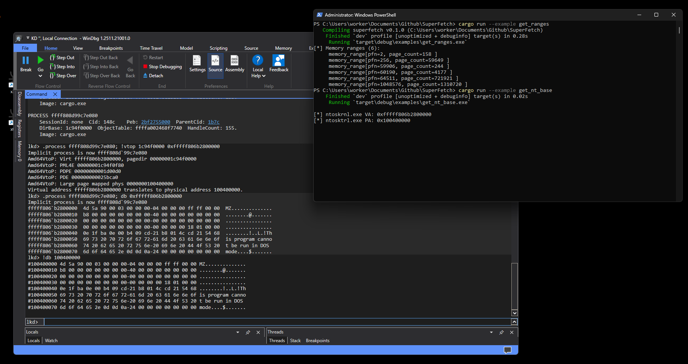

# SuperFetch

<div align="center">


</div>

## Overview
`SuperFetch` is a Rust library designed to speed up the memory tool and exploit development on Windows systems. This crate will help you to quickly turn the virtual address to physical, using one simple function.

## Technique details

This crate utilizes the [Superfetch](https://learn.microsoft.com/en-us/windows-hardware/test/assessments/superfetch-prepare-memory-duration). 
This is a Windows service that can speed up data access by preloading it. If you are wondering how it works, I strongly recommend you to read these articles:
 - [Inside windows page frame numbers](https://rayanfam.com/topics/inside-windows-page-frame-number-part1/) by [Sina Karvandi](https://github.com/SinaKarvandi)
 - [Windows address translation deep dive](https://bsodtutorials.wordpress.com/2024/04/05/windows-address-translation-deep-dive-part-2/) by 0x14c
 - [The SuperFetch Query superpower](https://v1k1ngfr.github.io/superfetchquery-superpower/) by [Viking](https://github.com/v1k1ngfr)

Later, I will write a small note explaining his technique on the high level, and leave it on project github.

This crate is based on the C++ library [superfetch](https://github.com/jonomango/superfetch) created by [jonomango](https://github.com/jonomango).

## Example

```rust
use superfetch::MemoryMap;

fn main() {
    let nt_base: LPVOID = get_base_addr("ntoskrnl.exe")?;

    let mm = unsafe { MemoryMap::snapshot()? };

    match mm.translate(nt_base){
        Ok(nt_base_pa) => {
            println!("[*] ntoskrnl.exe VA: {:p}", nt_base);
            println!("[*] ntosktrl.exe PA: {:#x}", nt_base_pa);
        }
        Err(e) => {
            println!("[!] {}", e);
        }
    }
}
```

_You can find full example in example folder._

## Demo

<div align="center">

</div>

Example work demo. Successfull translate virtual memory to physical.

## Creds

prod by _I3r1h0n_.